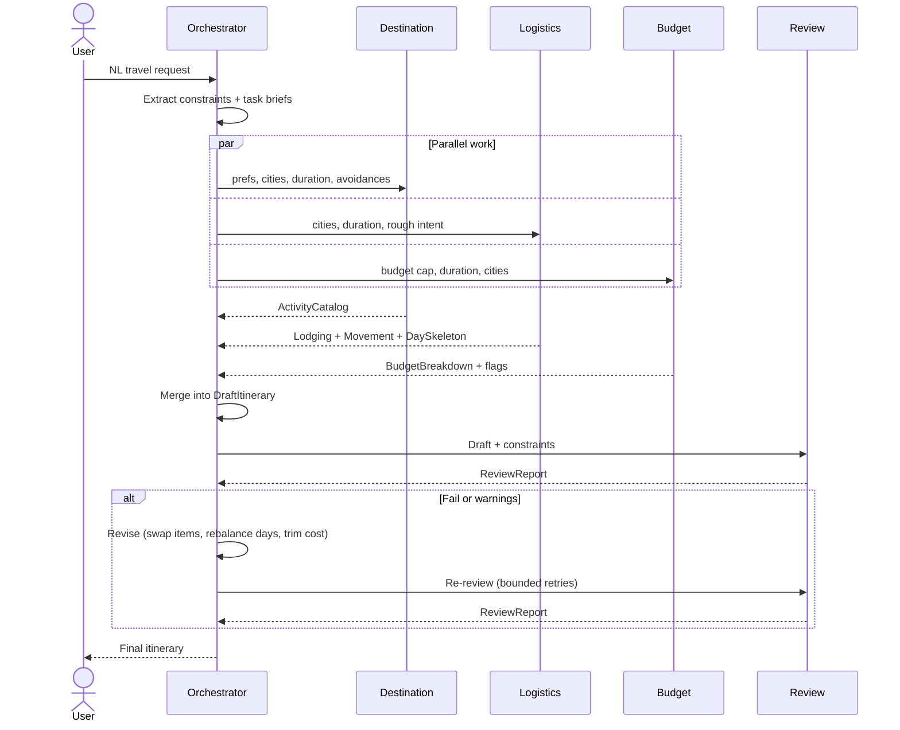

# Implementation Plan: AI Travel Planner — Phase-Wise Implementation Plan

> **Implements:** [`ProblemStatement.txt`](../ProblemStatement.txt) · [`context.md`](./context.md) · [`Architecture.md`](./Architecture.md)
> **Created:** 2026-09-02

---

## Overview

This plan implements the system described in `ProblemStatement.txt` and `context.md` according to `Architecture.md`. Phases are ordered so each builds on stable contracts and ends with a demo-ready vertical slice.

The deliverable includes a **backend** (HTTP API + multi-agent runtime) and a **frontend** (request UI + itinerary presentation).

---

## Guiding Principles

| Principle | Detail |
|---|---|
| **Constraints first** | One orchestrator pass extracts `TravelConstraints`; worker agents never re-parse the raw user string as the source of truth for duration, cities, or budget |
| **Typed artifacts** | Implement shared schemas (Pydantic / JSON Schema) before wiring LLM prompts; share the same contract with the frontend (OpenAPI codegen, shared package, or duplicated types checked in CI) |
| **Pipeline** | `Orchestrator → parallel(Destination, Logistics, Budget) → merge → Review → (optional repair) → user` |
| **Backend owns intelligence** | LLM keys, agents, and tools run only on the server |
| **Frontend owns experience** | Input, loading and error states, structured rendering of the plan and disclaimer; no secrets in the browser |
| **Scope** | Educational / PM-demo quality; illustrative pricing and logistics, not production booking |

---

## Mapping to User-Visible Outputs

| Problem Statement Output | Primary Phases |
|---|---|
| Day-by-day trip outline | Phase 4 (Logistics skeleton), Phase 5 (merge), Phase 7 (narrative) |
| Neighborhoods / areas to stay | Phase 3–4 (Destination + Logistics) |
| Travel logistics between cities | Phase 4 (`MovementPlan`), Phase 6 (Review time realism) |
| Budget-friendly recommendations | Phase 5 (Budget), Phase 5 merge / Phase 8 (swaps) |
| Final itinerary respecting prefs + constraints | Phase 5–8 (merge, Review, repair) |
| Web UI for request + plan display | Phase 9 (frontend); depends on stable `POST /api/plan` from Phase 0 / 7 |

---

## Phase 0 — Project Skeleton and Configuration *(Backend)*

**Goal:** Runnable backend with config, secrets, and a single "hello plan" path without full agents.

### Tasks
- Choose backend stack (e.g. Python + FastAPI, or Node + Express/Fastify); add dependency management and `.env.example` (API keys, model names, CORS allowlist for later frontend URL)
- Add minimal HTTP surface:
  - `GET /health`
  - `POST /api/plan` with body `{ "request": "..." }` returning stub JSON matching the eventual response shape
- Central trace ID per request; return `trace_id` in JSON for support and demos
- Optionally scaffold an empty frontend repo folder or monorepo `apps/web` with placeholder page (no API wiring until Phase 9)

### Exit Criteria
- [ ] One command starts the backend
- [ ] Health check passes
- [ ] `POST /api/plan` returns stub JSON with `trace_id` in logs

---

## Phase 1 — Shared Data Model and Validation

**Goal:** All agent boundaries compile and validate against the same types.

### Tasks
- Define schemas for:
  - `TravelConstraints`
  - `ActivityCatalog`
  - `LodgingPlan`
  - `MovementPlan`
  - `DaySkeleton`
  - `BudgetBreakdown`
  - `DraftItinerary`
  - `ReviewReport`
  - `RepairHints` *(optional)*
- Enforce **stable IDs** on catalog activities and lodging suggestions for merge and re-review
- Unit tests: valid fixtures deserialize; invalid payloads fail with clear errors

### Exit Criteria
- [ ] Golden JSON fixtures for a "Japan 5d Tokyo Kyoto $3000" example round-trip through parsers **without LLM calls**

---

## Phase 2 — LLM Client and Structured Extraction *(Orchestrator — Part A)*

**Goal:** Natural language → `TravelConstraints` only.

### Tasks
- Integrate chosen LLM SDK; support structured output (JSON schema / tool output) with low temperature for extraction
- Prompt + schema for:
  ```
  destination_region, cities[], duration_days,
  budget_total, currency,
  preferences[], avoidances[],
  hard_requirements[], soft_preferences[]  (optional)
  ```
- Fallback or repair prompt when JSON fails validation (single retry)

### Exit Criteria
- [ ] Sample strings from the problem statement produce constraints that match expected fields in automated or manual checks

---

## Phase 3 — Tool Router *(Stubs First)*

**Goal:** Single place for search, geo, pricing, FX with timeouts, logging, and cache keys.

### Tasks
- Implement `ToolRouter` interface with methods:
  - `search`
  - `geo_estimate`
  - `price_band`
  - `fx_convert`
  *(initially stub or static JSON files)*
- Per-call timeout, trace propagation, simple in-memory cache for identical queries

### Exit Criteria
- [ ] Agents can call tools through the router without knowing implementation
- [ ] Swapping stub → real search is a **router change only**

---

## Phase 4 — Worker Agents *(v1, Sequential OK for Debugging)*

**Goal:** Each agent returns its primary artifact given `TravelConstraints` + stubs.

---

### Phase 4a — Destination Research Agent

| | |
|---|---|
| **Inputs** | `TravelConstraints` + optional `ToolRouter.search` |
| **Output** | `ActivityCatalog` — neighborhoods, temples, food, experiences; `crowd_level`; must-do vs nice-to-have; less-crowded options where possible |

---

### Phase 4b — Logistics Agent

| | |
|---|---|
| **Inputs** | `TravelConstraints` + optional geo/transit stubs |
| **Output** | `LodgingPlan`, `MovementPlan`, `DaySkeleton[]` — nights per city, inter-city mode (e.g. Shinkansen), ordered days with travel-time estimates, reduced backtracking |

---

### Phase 4c — Budget Agent

| | |
|---|---|
| **Inputs** | `TravelConstraints` + static price bands (hotels, food, transport, activities) + FX stub |
| **Output** | `BudgetBreakdown` — stay / transport / food / activities; `within_budget`; `violations[]`; `suggested_swaps[]` |

---

### Phase 4 — Shared Tasks
- One module per agent; shared system prompt patterns; role-specific prompts returning only validated JSON matching Phase 1 schemas
- Tests with **mocked LLM** returning canned JSON to keep CI deterministic

### Exit Criteria
- [ ] For a fixed `TravelConstraints` fixture, all three agents produce valid artifacts (integration test with mocks)

---

## Phase 5 — Orchestrator Merge and Parallel Execution *(Orchestrator — Part B)*

**Goal:** Implement the core pipeline segment: `parallel workers → DraftItinerary`.

### Tasks
- Run Destination, Logistics, Budget **concurrently** (async or thread pool) with the same read-only `TravelConstraints`
- Implement `merge(catalog, logistics, budget) -> DraftItinerary`:
  - Resolve conflicts (what vs when vs cost)
  - Attach budget summary
  - Link slots to catalog IDs
- Optional: second Budget pass on full draft for tighter numbers

### Exit Criteria
- [ ] End-to-end (real LLM in dev only): one NL request produces a coherent `DraftItinerary` JSON with day-by-day structure, neighborhoods, and category spend

---

## Phase 6 — Review Agent *(Programmatic + LLM)*

**Goal:** Quality gate before user delivery.

### Tasks

**Layer 1 — Programmatic** *(cheap, reliable)*
- `duration_days` matches day count
- All required cities appear in the plan
- Total estimated spend ≤ `budget_total` (using Budget numbers)
- Basic structural checks

**Layer 2 — LLM** *(qualitative)*
- Rubric for food/temple alignment, crowd avoidance effort, narrative coherence, logistics realism
- Output `ReviewReport` with `blocking` vs `advisory` severity
- If Layer 1 fails, optionally skip or shorten Layer 2

### Exit Criteria
- [ ] Known-bad drafts (wrong city, over budget, wrong day count) fail programmatic checks
- [ ] Good demo draft passes with documented checklist in `ReviewReport`

---

## Phase 7 — Repair Loop and Final User-Facing Plan *(Orchestrator — Part C)*

**Goal:** Bounded revision when Review fails and final user payload synthesis.

### Tasks
- **Max 2–3 repair cycles:** orchestrator consumes `ReviewReport` + optional `RepairHints` (trim activities, swap lodging area, rebalance days)
- After pass or max retries, expose `plan(request) -> FinalItinerary` with disclaimer text
- Format API response for PM demo and frontend consumption:
  - Structured fields: days, cities, budget rollup
  - Optional markdown or HTML snippet
  - Include `disclaimer` string
- Document `POST /api/plan` request/response in OpenAPI or equivalent

### Exit Criteria
- [ ] Intentionally over-budget or logistics-broken merged draft is corrected or clearly reported within retry budget
- [ ] API contract is stable enough for the frontend to integrate without guessing field names

---

## Phase 8 — Hardening and Demo Polish

**Goal:** Non-functional behaviors and optional real tools.

### Tasks
- Per-agent timeouts; partial failure messaging (*"logistics unavailable"*)
- Observability: log prompt summaries, tool calls, artifact versions, Review outcome *(avoid logging full secrets)*
- Replace one stub with a real integration if desired (e.g. web search for Destination only); cap calls per request
- `README`: how to run backend (and frontend after Phase 9), example curl / JSON, architecture pointer
- CORS: confirm production and dev origins allowed for `POST /api/plan`

### Exit Criteria
- [ ] Repeatable demo script
- [ ] Failure modes are graceful
- [ ] Latency acceptable for live walkthrough

---

## Phase 9 — Frontend Application

**Goal:** Web UI that talks only to the backend API and presents the trip plan.

### Tasks

**Setup**
- Choose frontend stack (e.g. Vite + React, or Next.js static export)
- Config: environment variable for API base URL (`VITE_API_URL` / `NEXT_PUBLIC_API_URL` etc.); **no API keys in client code**

**Screens / Components**

| Component | Detail |
|---|---|
| **Request form** | Textarea + submit; optional preset example matching problem statement |
| **Loading state** | For long `POST /api/plan` calls; cancel is optional (`AbortController`) |
| **Results layout** | Day-by-day outline, neighborhoods/stay suggestions, logistics (inter-city + pacing), budget breakdown, review status (pass / warnings / issues), **disclaimer prominently** |
| **Error UI** | Validation errors, 5xx, and timeout with suggestion to retry and `trace_id` if returned |

**Types**
- Generate or hand-maintain TypeScript types from OpenAPI / JSON Schema exported by backend (Phase 7–8)
- Keep field names aligned with `FinalItinerary` response

**Polish**
- Basic responsive layout and accessible labels for demo recordings

### Exit Criteria
- [ ] From the browser: submit sample request → see full itinerary sections populated from real API (dev backend)
- [ ] Production build serves static assets
- [ ] README documents `npm run dev` + proxy or env for API

---

## Phase 10 — Optional Extensions

Per [`Architecture.md`](./Architecture.md) — Optional Extensions:

- **Presenter agent** for UI formatting (or richer markdown pipeline on backend)
- **RAG** over curated travel guides
- **Human-in-the-loop** when Review remains red after max repair cycles
- **Durable `PlanState` store** and versioned drafts for audit; optional `GET /api/plan/{id}` for frontend history view

---

## Milestone Checklist

| Milestone | Phases Complete | Demo Capability |
|---|---|---|
| **M1** | 0–2 | "Constraints from text" (API or CLI) |
| **M2** | 0–4 | "Three specialist JSON outputs" |
| **M3** | 0–5 | "One merged draft itinerary" |
| **M4** | 0–7 | "Validated / repaired final plan" (API) |
| **M5** | 0–8 | "Stable PM-ready demo" (API + docs) |
| **M6** | 0–9 | "Full-stack demo" (browser UI + backend) |

---

## Diagram Flow — Agent Sequence



---

## Dependency Graph — Phase Build Order

```
Phase 0 (backend)
    └── Phase 1 (shared schemas)
            └── Phase 2 (LLM + constraint extraction)
                    └── Phase 3 (tool router)
                            ├── Phase 4a (Destination Agent)
                            ├── Phase 4b (Logistics Agent)
                            └── Phase 4c (Budget Agent)
                                    └── Phase 5 (parallel merge → DraftItinerary)
                                                └── Phase 6 (Review Agent)
                                                            └── Phase 7 (repair loop + stable API)
                                                                        └── Phase 8 (hardening + polish)
                                                                                    └── Phase 9 (frontend)
                                                                                                └── Phase 10 (optional extensions)
```

> This order keeps **schemas ahead of agents**, **agents ahead of merge**, **Review + repair after a real `DraftItinerary` exists**, and the **frontend after a stable `POST /api/plan` contract** (Phases 7–8).
